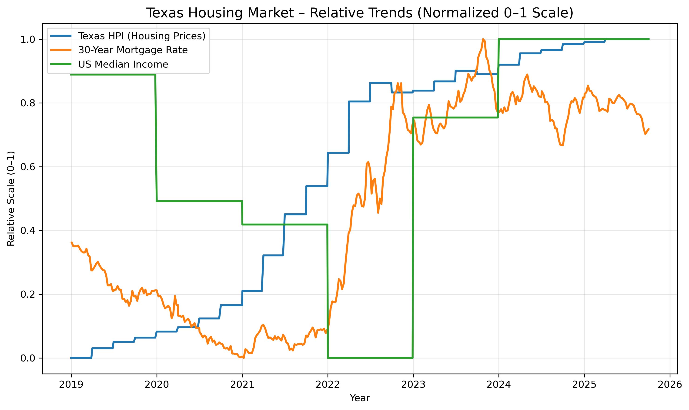

# 🏠 Texas Housing Markets 2025 – Data Query & Visualization

## Overview
This notebook queries real economic data from the **Federal Reserve (FRED)** to explore key indicators that influence Texas housing investment conditions:
- **Texas Home Price Index (TXSTHPI)**
- **30-Year Fixed Mortgage Rate (MORTGAGE30US)**
- **US Median Household Income (MEHOINUSA672N)**

## What It Does
1. Pulls live data via `pandas_datareader`
2. Merges datasets with different frequencies (weekly, quarterly, annual)
3. Visualizes price, rate, and income trends
4. Normalizes indicators for side-by-side comparison

## Tools Used
- Python, Pandas, Matplotlib  
- Jupyter Notebook  
- Data Source: [FRED – Federal Reserve Economic Data](https://fred.stlouisfed.org)

## Sample Output

## Next Steps
- Add Texas rental data from Data.gov  
- Compute a “Texas Housing Affordability Index” combining price, income, and mortgage rate data.
=======